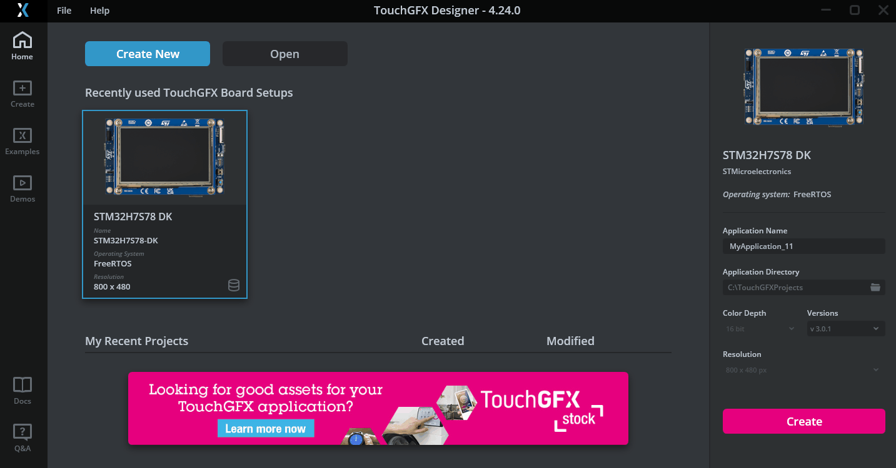
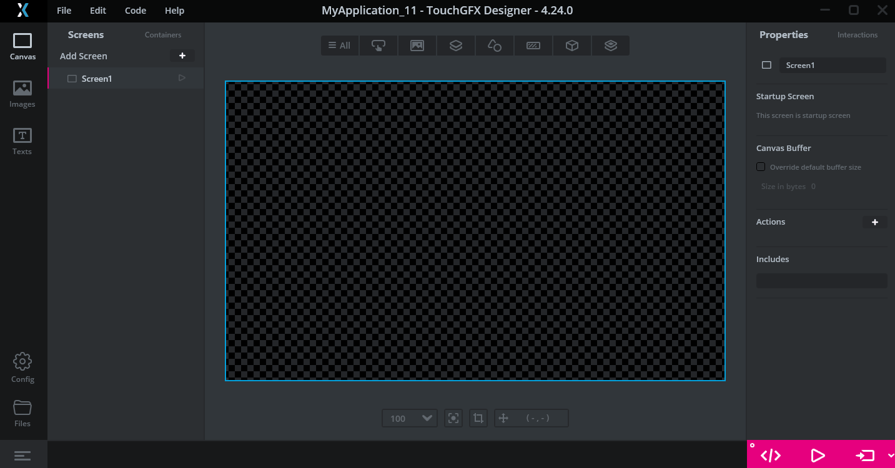

# STM32H7RSWorkShop-Benefit of NeoChrom Demontration

The example will guide you through creating a graphical user interface on STM32H7S78-DK which demonstrate the benefit of 
NeoChrom GPU. We will use TouchGFX designer tool to create this interface which is composed of  an icon that continously 
rotating and a button which allows to activate/deactivate NeoChrom IP.

## Prerequisites

- TouchGFX Designer 4.24.0 
- STM32H7S78-DK board

## TouchGFX Designer 4.24.0

### Project startup

#### 1. Run TouchGFX Designer 4.24.0
#### 2. Create New project targetting the STM32H7S78-DK board
  
#### 3. Add an image 
  
#### 4. Select a image with the screen size (800x480)
  
#### 5 Add a texture mapper

